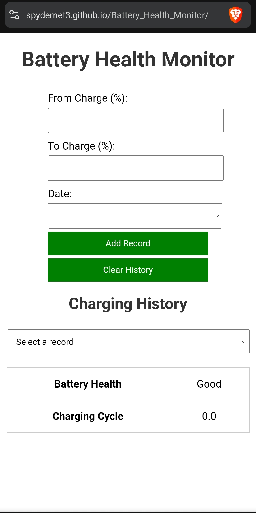

## Hi there 👋 [ Ads & Tracker Free Hub 🔥 ]
# My Stories

<table>
  <tr>
    <td align="center">
      <figure>
        
        <figcaption>Nothing Reminder</figcaption>
      </figure>
    </td>
    <td align="center">
      <figure>
        
        <figcaption>Smart YouTube Filter</figcaption>
      </figure>
    </td>
    <td align="center">
      <figure>
        
        <figcaption>QR Code Gen</figcaption>
      </figure>
    </td>
    <td align="center">
      <figure>
        
        <figcaption>Multi Web Browser</figcaption>
      </figure>
    </td>
  </tr>
  <tr>
    <td align="center">
      <figure>
        
        <figcaption>Farewell Wishes</figcaption>
      </figure>
    </td>
    <td align="center">
      <figure>
        
        <figcaption>Live Audio Transcrib</figcaption>
      </figure>
    </td>
    <td align="center">
      <figure>
        
        <figcaption>Battery Health Monitor</figcaption>
      </figure>
    </td>
    <td align="center">
      <figure>
        
        <figcaption>Note Pad</figcaption>
      </figure>
    </td>
  </tr>
  <tr>
    <td align="center">
      <figure>
        
        <figcaption>Smart Card</figcaption>
      </figure>
    </td>
  </tr>
</table>

## 🛠 Skills
- Python, JavaScript, HTML/CSS
- AI,Mini Apps, Website Designing,Etc

## 📂 Projects
- [Nothing Reminder](https://spydernet3.github.io/Nothing-Reminder/)
- [ Smart Youtube Filter](https://you-tube-seven.vercel.app/)
- [QR Code Generator](https://spydernet3.github.io/QR-Generator/)
- [ Multi Website Browser](https://spydernet3.github.io/multi_website_browser/)
- [ Farewell Wishes](https://spydernet3.github.io/farewell/)
- [Live Audio Transcrib](https://spydernet3.github.io/live-audio-transcrib/)
- [ Battery Health Monitor](https://spydernet3.github.io/Battery_Health_Monitor/)
- [ Notepad](https://spydernet3.github.io/Notepad/)
- [ Auto Mailing ](https://github.com/spydernet3/AUTO-MAILING.git)
- [ Auto Sms ](https://github.com/spydernet3/Text-messaging-.git)
- [ Smart Card ](https://spydernet3.github.io/Smart-Card/)

## 📈 GitHub Stats

## Other 📦
- 🔭 I’m currently working on ...

- [4 In a Row Game] ! [ Telegraph ] ! [ Nothing Reminder ] ! [ Click Counter ]

- 👯 I’m looking to collaborate on ...
  let we Discuss About it later...
  
- 🤔 I’m looking for help with ...
[ Special AI ]

 -->

## Would You want 📫 Connect with me
[Twitter](https://x.com/spyder_net) | [Telegram](https://telegram.me/gplat_bot) | [ website](https://sites.google.com/view/irffunfacts)

## 💬 Chat with my AI Bot
She Knows Everything

## KaththuKutty 🤓

